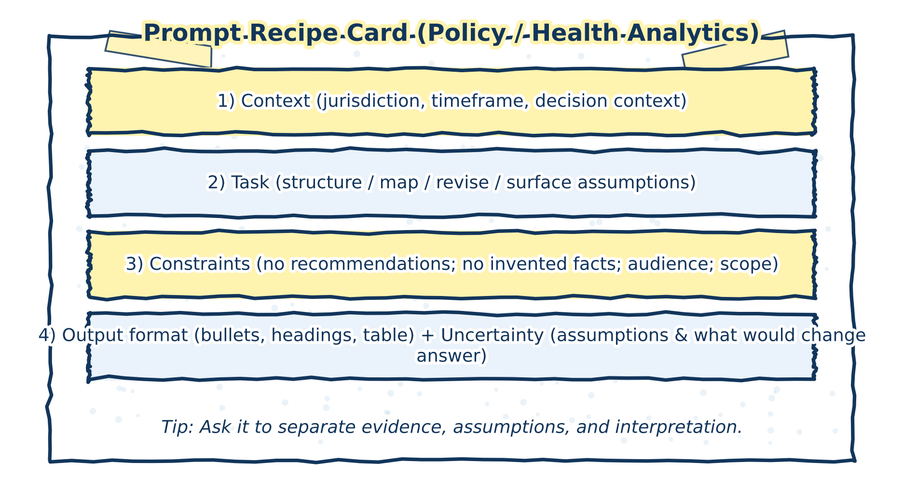

# Prompt Patterns for Inquiry and Synthesis

Prompts are the primary mechanism through which users interact with generative AI systems. In research and analytical contexts, prompts are most effective when they are designed to support inquiry, reflection, and sense‑making rather than answer‑seeking or decision‑making. How a prompt is framed shapes not only what the system produces, but also how its output is interpreted and used.

This chapter treats prompting as a methodological practice rather than a technical trick. The emphasis is on using prompts to open up lines of inquiry, surface alternatives, and make reasoning more explicit—while keeping evaluative judgment and responsibility firmly with the researcher.


The figure below provides a reusable prompt “recipe card” designed for policy and health analytics workflows.


```{r prompt-recipe-card-figure, echo=FALSE, fig.cap="Prompt recipe card for inquiry and synthesis. A structured prompt clarifies context, task, constraints, format, and uncertainty without delegating judgment.", out.width="95%", fig.align="center"}

```

## Prompts as research instruments

A prompt can be understood as a research instrument. Like other instruments, it frames a task, constrains the space of possible responses, and implicitly encodes assumptions about what matters, what is fixed, and what is open to interpretation. Thoughtful prompting therefore requires attention not only to what is being asked, but to what kinds of reasoning are being invited—and what kinds are being excluded.

In this sense, prompts are not neutral. A prompt that asks for a conclusion, recommendation, or “best answer” implicitly shifts authority to the system’s output. By contrast, prompts that ask for perspectives, contrasts, alternative framings, or conditional analyses reinforce the exploratory nature of the interaction. They position the AI as a tool for generating material to think with, rather than as a source of determinate answers.

Designing prompts as research instruments supports disciplined inquiry while preserving the researcher’s role as the final arbiter of relevance, adequacy, and meaning.

## Core prompt patterns

The following prompt patterns recur throughout this book. They are presented not as templates to be followed mechanically, but as families of approaches that can be adapted to different domains and stages of analysis.

### Structuring questions

Prompts can be used to decompose broad, ambiguous, or ill‑defined topics into more manageable sub‑questions or lines of inquiry. This is particularly useful at early stages of research, when the problem space itself is still being clarified.

The value of this pattern lies in generating candidates for further investigation. The resulting questions should not be treated as exhaustive, definitive, or hierarchically ordered. Instead, they serve as a working map that the researcher can refine, prune, or reorganize based on domain knowledge and evolving analytical goals.

#### Mini‑example: decomposing an ill‑defined problem

> **Hypothetical prompt**  
> “Break this broad research topic into distinct analytical questions that could be explored, without prioritizing or ranking them.”

> **Illustrative outcome**  
> The system proposes several question clusters (e.g. scope, mechanisms, impacts, implementation considerations).

> **How it is used**  
> The researcher reviews the list, removes irrelevant questions, and reframes others to better align with the project’s mandate.

#### Misuse or overreach

> **Counter‑example**  
> Treating the generated questions as a complete or authoritative problem definition and proceeding without further refinement.

This risks locking in the system’s framing and prematurely excluding lines of inquiry that require contextual or domain‑specific insight.

#### Review and quality‑assurance implications

- Assess whether key dimensions are missing or mischaracterized  
- Cross‑check questions against project objectives and stakeholder needs  
- Document how and why the final research questions were selected  

### Mapping arguments and counterarguments

Generative AI systems can assist in laying out competing positions, interpretations, or lines of reasoning around a topic. When used carefully, this can help clarify the structure of a debate, make tensions explicit, and identify where claims rely on thin evidence or unstated assumptions.

This pattern is most effective when outputs are treated as schematic rather than authoritative. The goal is not to settle disagreements, but to make their contours visible so that they can be evaluated using appropriate evidence, methods, and standards of reasoning.

#### Mini‑example: clarifying a contested issue

> **Hypothetical prompt**  
> “Outline the main arguments and counterarguments surrounding this issue, without assessing which is stronger.”

> **Illustrative outcome**  
> The system presents contrasting positions, each with stated rationales and implied trade‑offs.

> **How it is used**  
> The researcher uses the outline to identify where empirical evidence is required and where normative assumptions are driving disagreement.

#### Misuse or overreach

> **Counter‑example**  
> Presenting the AI‑generated argument map as a balanced or complete representation of the debate.

This can obscure power asymmetries, missing perspectives, or the relative credibility of different sources.

#### Review and quality‑assurance implications

- Verify that major perspectives are not omitted  
- Check that arguments are not falsely symmetrized  
- Anchor each position to actual sources or stakeholder views  

### Surfacing assumptions and gaps

Prompts that ask explicitly about assumptions, dependencies, uncertainties, or missing information can help bring implicit commitments to the surface. These prompts are particularly useful for reviewing drafts, early analytical notes, or preliminary interpretations.

By externalizing assumptions and gaps, this pattern supports reflexivity: it allows researchers to examine how their framing choices shape conclusions, and where additional evidence or clarification may be needed before claims can be responsibly advanced.

#### Mini‑example: reviewing a draft analysis

> **Hypothetical prompt**  
> “Identify key assumptions, uncertainties, and information gaps implicit in this draft.”

> **Illustrative outcome**  
> The system highlights assumptions about scope, data quality, and causal mechanisms.

> **How it is used**  
> The researcher evaluates which assumptions are acceptable, which require justification, and which indicate the need for further analysis.

#### Misuse or overreach

> **Counter‑example**  
> Treating the AI‑identified assumptions as exhaustive and overlooking others that require domain expertise to recognize.

This can create a false sense of methodological completeness.

#### Review and quality‑assurance implications

- Compare AI‑surfaced assumptions with those identified by peers or reviewers  
- Explicitly address key assumptions in the final analysis  
- Track how gaps are resolved or acknowledged  

## Prompting with constraints and caution

Adding constraints—such as intended audience, scope, uncertainty, or acceptable levels of confidence—helps reinforce the exploratory and provisional nature of AI‑assisted work. Constraints do not narrow thinking so much as they discipline it, making explicit the conditions under which an output might be useful.

Throughout this book, prompts are treated as tools for thinking with AI, not as instructions for delegating analytical responsibility. Effective prompting does not eliminate the need for review, verification, or judgment; it makes those activities more focused and more transparent.

Used well, prompt patterns can support clarity without false certainty and exploration without abdication of responsibility. Used uncritically, they risk producing polished outputs that mask unresolved questions. The difference lies not in the prompt itself, but in how its results are interpreted and acted upon.

## Transition: from prompting to evaluation

This chapter has focused on how prompts can be designed to support inquiry, synthesis, and reflexive analysis. The next chapter shifts attention from elicitation to evaluation: how AI‑assisted outputs can be reviewed, documented, and governed in ways that preserve accountability and analytical integrity.

Where prompting shapes what is produced, evaluation determines what is accepted, revised, or rejected. Together, these practices form the backbone of responsible AI‑assisted research.