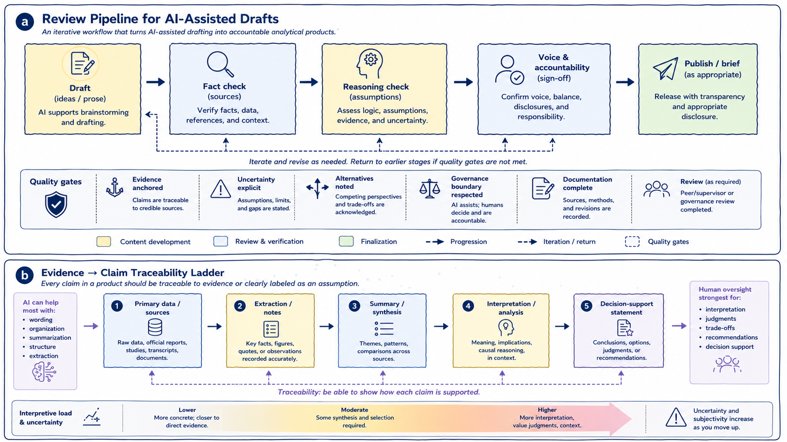

# Reviewing and Revising AI-Assisted Drafts

Responsible use of generative AI in policy and health analytics requires systematic review, active revision, and explicit accountability for all AI-assisted outputs. This chapter examines how analytical rigor, evidentiary discipline, and interpretive control can be maintained when generative AI systems participate in drafting, synthesis, or exploratory analytical work. 

The central principle is straightforward:

> AI-generated text is always provisional.

Generated material becomes part of an analytical product only through deliberate human evaluation, verification, revision, and integration. Without review, AI-generated outputs remain unverified linguistic artifacts rather than accountable analytical work.

The figure below summarizes two complementary dimensions of responsible AI-assisted review. Panel (a) presents a review pipeline for transforming AI-assisted drafts into accountable analytical products, while panel (b) illustrates an evidence-to-claim traceability ladder showing how analytical statements should remain anchored to identifiable sources and explicit assumptions.

```{r review-traceability-figure, echo=FALSE, fig.cap="Panel (a) illustrates a review pipeline for AI-assisted drafting, emphasizing iterative verification, reasoning review, and analytical accountability. Panel (b) illustrates an evidence-to-claim traceability ladder, showing how analytical claims should remain connected to identifiable sources, interpretation boundaries, and explicit uncertainty.", out.width="100%", fig.align="center", fig.pos='H'}

```

As illustrated in panel (a), responsible AI-assisted drafting is not a linear progression from generation to publication. It is an iterative process involving repeated cycles of fact-checking, reasoning review, revision, accountability assessment, and, at times, rejection altogether. Generated material may move backward through the workflow multiple times before becoming suitable for circulation or publication. Some outputs may ultimately be discarded entirely if they fail evidentiary, methodological, or governance review.

Panel (b) complements this workflow by illustrating a second foundational principle: analytical claims should remain traceable to identifiable sources and clearly separated from interpretation, synthesis, and uncertainty. Together, the two panels reinforce a central theme running throughout this book:

> AI may assist with wording, organization, and synthesis, but analytical legitimacy comes from evidence, review, and human accountability.

Review should therefore not be understood merely as proofreading or stylistic refinement added after drafting. In policy and health analytics, review functions as a form of analytical governance. It is the process through which generated material becomes evidence-aware, contextually appropriate, methodologically defensible, and institutionally accountable.

Generative AI systems can produce coherent and persuasive prose regardless of whether the underlying reasoning is sound or the evidence is reliable. Fluency alone is therefore not an indicator of analytical quality. Review acts as the mechanism that separates plausible language from defensible analysis.

As shown in panel (a), responsible review extends beyond factual correction. It also requires evaluating framing, assumptions, uncertainty, proportionality of claims, interpretive balance, and accountability for conclusions. Importantly, review must include the possibility of rejection. Some AI-generated material may be unsupported, misleading, contextually inappropriate, or analytically weak and therefore should not remain in the final product.

One important aspect of review concerns the role AI assistance itself played within the workflow. AI support is appropriate when it contributes to framing, drafting, synthesis, organization, or reflection without substituting for analytical judgment or evidentiary validation. Review therefore involves examining whether AI assistance supported inquiry rather than making decisions, whether generated material was treated as working material rather than authority, and whether human expertise remained central to interpretation and validation throughout the workflow.

As panel (a) suggests, governance review is not separate from analytical review. It is embedded throughout the drafting and revision process itself.

Review must also examine how framing shapes analysis. Generative AI systems can influence framing subtly and early in the workflow. Initial prompts, generated summaries, or proposed categorizations may shape how a problem is understood before alternatives are fully explored.

For example, a policy issue framed primarily through efficiency considerations may unintentionally minimize equity implications, implementation feasibility, stakeholder impacts, or long-term consequences. Responsible review therefore requires deliberate reflection on whether framing choices remain intentional rather than inherited from generated outputs. Analysts should compare alternative framings, identify excluded perspectives, and reassess framing choices as evidence evolves.

Factual accuracy and evidence discipline represent another central review responsibility. AI-generated content can be plausible while still being incorrect. As illustrated in panel (b), analytical claims should remain traceable either to identifiable evidence or to explicitly labeled assumptions and interpretations.

This distinction becomes increasingly important as analytical work moves upward from extraction to synthesis, interpretation, and decision-support language. At lower levels of the ladder, outputs remain closer to observable or documentable evidence. At higher levels, interpretation, contextual judgment, trade-offs, and uncertainty become more significant. Human oversight therefore becomes progressively more important as analytical work moves toward interpretation and recommendation.

Any factual claim introduced or modified through AI assistance should be verified against primary sources, authoritative literature, validated institutional information, or administrative data where appropriate. Particular caution is required for quantitative claims, causal interpretations, jurisdictional comparisons, legal or regulatory descriptions, and health intervention claims.

One common failure mode occurs when AI-generated context is treated as “general knowledge” that does not require verification. In practice, even plausible contextual statements should remain subject to evidence review and traceability checks.

Review must also extend beyond factual correctness to reasoning quality itself. Even when factual claims are accurate, reasoning may still be weak, assumption-heavy, incomplete, overconfident, or rhetorically persuasive without sufficient evidentiary support.

Generative AI systems can reproduce familiar argumentative structures, but they do not independently evaluate the validity of those structures. A draft may therefore appear coherent while relying on hidden assumptions, unsupported inference, weak causal reasoning, or rhetorical momentum rather than evidence.

As shown in panel (a), reasoning review requires explicit assessment of assumptions, uncertainty, evidence proportionality, and alternative interpretations. Panel (b) reinforces this point by illustrating how interpretive uncertainty increases as analysis moves further from primary evidence toward synthesis, interpretation, and decision-support language. This means that interpretive claims require stronger review, uncertainty should become more explicit, and recommendations require greater human oversight than extraction or summarization tasks.

A useful review question is therefore:

> *If the prose were removed, would the underlying reasoning still stand on evidence and logic alone?*

AI-assisted outputs also require careful review for balance and representation of alternatives. Generative systems may create false symmetry by presenting competing positions as equally credible even when evidence quality differs substantially.

Responsible review should therefore assess evidentiary balance, proportionality of competing claims, and representation of alternatives. Analytical neutrality does not require treating all positions as equally supported. Weakly supported claims should not receive equal analytical weight merely because they are expressed fluently or appear alongside stronger evidence.

Similarly, assumptions embedded within generated outputs should be surfaced explicitly wherever possible. Generative AI systems frequently reproduce assumptions embedded in prompts, training data, institutional norms, or dominant analytical conventions without making those assumptions visible.

These assumptions may concern data completeness, implementation feasibility, stakeholder behavior, baseline conditions, or causal relationships. Review therefore involves identifying which assumptions are justified, uncertain, unsupported, or dependent on missing evidence.

Another important review responsibility concerns authorship and accountability. AI assistance should never blur ownership of conclusions or analytical framing. As shown in panel (a), analytical ownership and sign-off remain explicitly human responsibilities regardless of how much drafting assistance was used.

Analysts must remain able to defend conclusions, explain reasoning, justify framing choices, and account for uncertainty. Maintaining authorship therefore requires active integration rather than passive acceptance of generated material. In practice, this often involves rewriting, restructuring, discarding, or substantially revising AI-generated text.

If a claim remains in a document solely because “the AI suggested it,” that is usually a sign that review was insufficient.

Transparency and documentation also play important roles in responsible AI-assisted workflows. In some research, policy, and health analytics contexts, documenting how AI tools were used may be appropriate or required.

At minimum, analysts should remain able to explain where AI assistance entered the workflow, what tasks it supported, how outputs were reviewed, and where human judgment shaped the final product. As shown in panel (a), documentation and review function as quality gates within responsible analytical workflows.

Throughout this chapter, one principle has remained central: effective AI-assisted analysis is iterative rather than one-off. Responsible workflows involve repeated cycles of prompting, reviewing, revising, testing, verifying, and occasionally rejecting outputs entirely. This iterative friction is not a weakness of the process; it is part of what makes analytical review rigorous.

Ultimately, panel (b) introduces perhaps the most important governing principle of responsible AI-assisted analysis: traceability. Every analytical claim should either remain traceable to identifiable evidence or be clearly labeled as interpretation, assumption, or uncertainty. This distinction helps preserve transparency between what is observed, what is inferred, and what is being recommended.

Generative AI may assist strongly with extraction, organization, summarization, and wording, but human oversight remains strongest for interpretation, trade-off analysis, recommendations, and decision support.

Across all stages of review and revision, the governing principle therefore remains consistent:

> Generative AI assists, but analysts decide.

Responsibility for accuracy, interpretation, reasoning, evidentiary discipline, and analytical impact cannot be delegated to a generative system.

Used with discipline, AI-assisted drafting can improve clarity, organization, and exploratory analysis without compromising rigor. Used without systematic review, the same tools can obscure uncertainty, weaken accountability, and blur the boundary between evidence and interpretation.

The difference lies not in the technology itself, but in the review, governance, and traceability practices that surround its use.

The practices discussed in this chapter are operationalized further in Appendix A, which provides a stage-based pre-submission checklist for AI-assisted analytical work. 