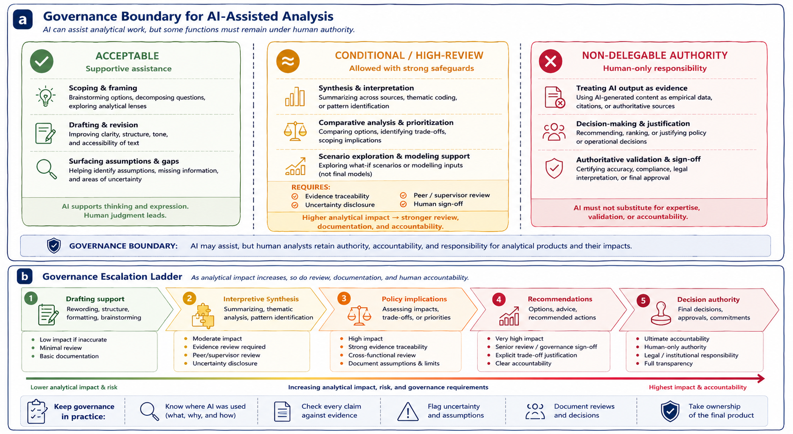

# Organizational Governance for AI-Assisted Analysis

This chapter outlines governance principles for the responsible use of generative AI assistants in policy and health analytics. Governance here is not understood as technical restriction or blanket prohibition. Instead, it refers to the norms, review practices, and accountability structures that help preserve analytical integrity, evidentiary discipline, and institutional trust when generative AI systems participate in analytical workflows.  

Because AI-assisted analysis can influence operational priorities, public communication, resource allocation, institutional processes, and decision-making environments, the central governance question is not whether generative AI is used, but under what conditions its use remains methodologically and institutionally responsible.

The figure below summarizes two complementary governance perspectives. Panel (a) illustrates governance boundaries separating acceptable, conditional, and non-delegable uses of generative AI in analytical environments. Panel (b) presents a governance escalation ladder showing how review expectations and accountability increase as analytical impact and decision influence become more significant.

```{r governance-boundary-figure, echo=FALSE, fig.cap="Panel (a) illustrates governance boundaries for AI-assisted analysis, distinguishing acceptable, conditional, and non-delegable uses of generative AI. Panel (b) illustrates a governance escalation ladder showing how review expectations, documentation, and human accountability increase as analytical impact rises.", out.width="100%", fig.align="center"}

```

As illustrated in panel (a), governance boundaries are normative rather than technical. Generative AI systems may be capable of producing recommendations, evaluations, interpretations, summaries, or comparative analyses, but institutional governance determines whether reliance on those outputs is appropriate in professional analytical settings.

Panel (b) complements this perspective by illustrating that governance requirements are not uniform across all AI-assisted activities. As analytical work moves from low-impact drafting support toward interpretation, recommendations, or decision authority, expectations for evidence traceability, review, documentation, disclosure, and human accountability increase substantially.

Together, the two panels reinforce a central principle of this book:

> AI may assist analytical work, but authority, accountability, and responsibility remain human.

Governance should therefore not be interpreted as opposition to AI use. Effective governance does not seek to eliminate generative AI from analytical environments. Instead, it embeds AI assistance within existing professional standards involving evidence review, methodological scrutiny, peer review, documentation, and accountability structures.

In policy and health contexts, analytical work is accountable not only to standards of evidence, but also to institutions, stakeholders, governance processes, and affected populations. Generative AI systems introduce risks that governance structures are intended to surface and manage. These risks include fabrication, overconfidence, framing effects, obscured assumptions, false balance, and diffusion of responsibility.

Governance therefore functions as a supporting structure that helps ensure AI-assisted analytical work remains reviewable, transparent, evidence-aware, and institutionally defensible. Importantly, governance does not replace judgment; it makes judgment visible, reviewable, and accountable.

As shown in panel (b), governance expectations should also be proportional to analytical impact and institutional risk. Not all AI-assisted tasks carry the same consequences if errors occur. Some forms of assistance involve relatively low analytical risk, while others may directly influence operational decisions, policy interpretation, or public outcomes.

Activities such as drafting support, structural revision, brainstorming, and organizational assistance generally involve lower governance risk than interpretation, comparative prioritization, recommendations, trade-off analysis, or decision-support language. As analytical influence increases, governance expectations should increase as well. Higher-impact analytical activities may require stronger evidence requirements, peer or supervisor review, documentation of assumptions, explicit uncertainty disclosure, or formal sign-off procedures.

Panel (b) visualizes this escalation principle directly:

> Higher analytical impact requires stronger review, documentation, and human accountability.

Panel (a) identifies one category of acceptable AI-assisted activities involving supportive analytical assistance. These uses help structure inquiry and improve communication while leaving evaluative judgment and accountability with human analysts.

For example, generative AI may assist with decomposing broad problems into analytical questions, organizing complex information, improving clarity and readability, surfacing ambiguities or assumptions, or helping researchers explore alternative framings. A researcher might use AI assistance to reorganize a briefing note for a senior audience or to identify where causal language appears stronger than the supporting evidence. In such cases, the analyst still reviews the suggestions, revises the material, and verifies claims against source information before accepting the output.

As illustrated in panel (a), these forms of assistance remain acceptable because AI supports thinking and expression rather than replacing analytical authority.

At the same time, panel (a) also introduces an intermediate governance zone involving conditional or high-review uses. These activities involve greater interpretive influence and therefore require stronger safeguards, review, and documentation.

Examples include synthesis across multiple sources, thematic coding, comparative analysis, prioritization, trade-off identification, or scenario exploration. These activities are not necessarily prohibited, but they should occur only with evidence traceability, uncertainty disclosure, peer or supervisory review, and explicit human sign-off.

This distinction matters because generated outputs at this stage may shape analytical direction, framing, prioritization, or implied recommendations even when explicit decisions are not being made. The closer AI-assisted work moves toward interpretation, recommendation, or institutional impact, the stronger human oversight must become.

Panel (a) also identifies a third category involving non-delegable authority. These are activities where responsibility must remain fully human regardless of AI capability.

For example, AI-generated text should never be treated as empirical evidence, authoritative validation, source confirmation, or verified findings. Generated material may assist organization or synthesis, but evidentiary legitimacy must come from identifiable and reviewable sources.

Similarly, generative AI systems should not make policy decisions, justify institutional actions, rank options authoritatively, determine operational outcomes, or replace expert approval and sign-off processes. These activities involve value judgments, accountability, institutional authority, trade-offs, and professional responsibility that cannot be delegated to probabilistic language systems.

One common governance failure occurs when AI-generated summaries or comparisons are treated as if they represent evidentiary consensus without direct review of the underlying sources. As shown in panel (a), governance boundaries exist specifically to prevent this kind of authority transfer.

Accountability for AI-assisted analytical work therefore remains fully human. The use of generative AI does not dilute professional responsibility, institutional accountability, analytical ownership, or authorship.

Analysts must remain able to explain how AI assistance was used, defend analytical choices and conclusions, identify and correct errors, and justify reasoning independently of the AI system. As illustrated in panel (b), accountability requirements become progressively stronger as analytical work moves upward toward interpretation, recommendations, policy implications, or decision authority.

If an analyst cannot explain or defend a claim without referring back to the AI system, that claim does not meet accountability standards.

Transparency and disclosure also play important roles in responsible governance. Disclosure should be proportional to the role AI played in the workflow and focused on helping reviewers or readers understand where AI assistance entered the process, what functions it supported, and how outputs were reviewed and validated.

In many contexts, this does not require preserving complete prompt histories, but it does require clarity regarding where human judgment shaped the final analytical product.

For example, internal disclosure language may state:

> “Generative AI was used to assist with drafting support and structural revision. All factual content, analysis, interpretation, and conclusions were reviewed and validated by the author.”

Similarly, external disclosure where appropriate may state:

> “AI-assisted tools were used for drafting support; responsibility for analysis and conclusions rests with the authors.”

Panel (b) further emphasizes an important operational principle: governance intensity should increase alongside analytical impact.

Lower-risk tasks such as formatting, brainstorming, or drafting support may require minimal review, lightweight documentation, and routine quality assurance. By contrast, higher-impact tasks involving interpretation, policy implications, recommendations, or operational decisions may require evidence traceability, uncertainty documentation, cross-functional review, supervisor sign-off, and stronger governance scrutiny.

This escalation model helps organizations avoid two common governance failures: treating all AI-assisted work as equally risky or applying insufficient review to high-impact analytical tasks.

As illustrated in panel (b), governance becomes operational through recurring practices such as documenting where AI was used, checking claims against evidence, flagging uncertainty and assumptions, recording reviews and approvals, and maintaining ownership of the final analytical product.

These practices do not eliminate the possibility of error, but they help ensure that analytical influence remains visible, assumptions remain reviewable, and responsibility remains attributable.

Ultimately, effective governance should be understood as an enabling structure rather than a restrictive one. Governance creates conditions under which AI assistance can support analytical work without undermining rigor, accountability, evidence discipline, or institutional trust.

Used responsibly, governance allows generative AI to remain useful while preserving the human authority necessary for professional analytical environments.

Across all governance contexts discussed in this chapter, the central principle therefore remains consistent:

> AI may assist analytical work, but authority cannot be delegated.

Generative AI systems may support drafting, synthesis, organization, comparison, and exploratory reflection, but responsibility for evidence, interpretation, recommendations, and institutional impact remains human.

The governance structures discussed in this chapter help preserve that distinction by ensuring that AI-assisted analysis remains reviewable, evidence-aware, transparent, and accountable.

Appendix A operationalizes these governance expectations further through a stage-based pre-submission checklist aligned with review workflow and accountability practices.