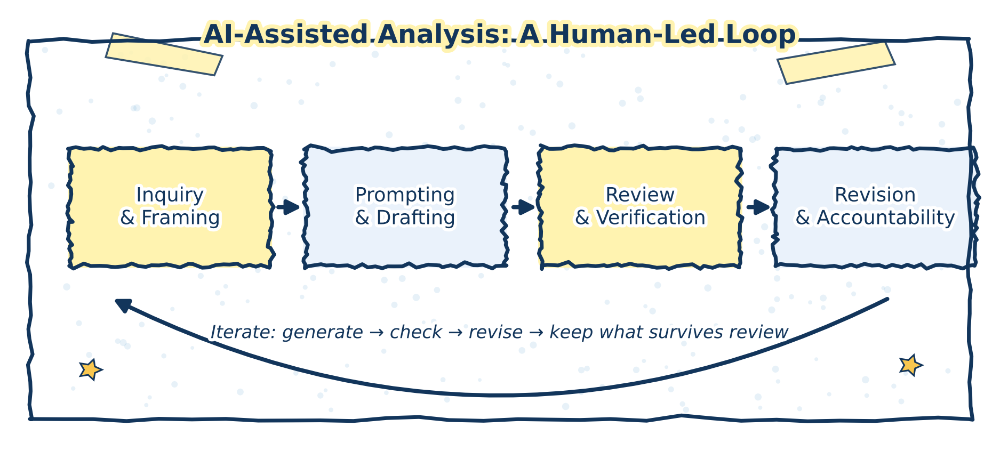

# Conceptual Foundations

Generative AI systems are increasingly positioned as assistants in research and investigative work. This book adopts that framing deliberately, while also setting clear limits on what such systems can and cannot do. The central concern is not efficiency or automation, but how AI tools can support thinking without displacing judgment, responsibility, or methodological care.

The figure below summarizes the human‑led lifecycle that frames the use of generative AI throughout this book.

(\#fig:lifecycle-figure)AI-assisted analysis as a human-led lifecycle. Generative AI contributes to exploration and drafting, while verification, judgment, and accountability remain human responsibilities.

## Thinking with AI, not delegating judgment

To describe generative AI as a research assistant is to make a normative claim about use. An assistant supports inquiry but does not determine its direction, validate its conclusions, or assume responsibility for its outcomes. In this book, AI systems are treated as instruments that participate in human reasoning processes rather than substitutes for them.

This distinction matters because generative models produce fluent and plausible text without understanding or epistemic awareness. Their outputs can be useful prompts for reflection, comparison, or re‑expression, but they do not constitute evidence or justification.

## Capabilities relevant to inquiry

Within these limits, generative AI can support several aspects of research and investigation:

- Structuring complex or ill‑defined questions
- Mapping arguments and counterarguments
- Reorganizing or summarizing large volumes of text
- Making assumptions and gaps more visible
- Improving clarity and coherence in analytical writing

These capabilities are best understood as supportive rather than decisive. They shape the space of possible interpretations but do not resolve questions of truth or relevance.

## Epistemic responsibility and accountability

A guiding principle of this book is that epistemic responsibility cannot be outsourced. While AI systems can assist with exploration and drafting, responsibility for accuracy, interpretation, and inference remains human. This stance underpins all subsequent chapters and informs the prompt patterns, examples, and review practices discussed later.
