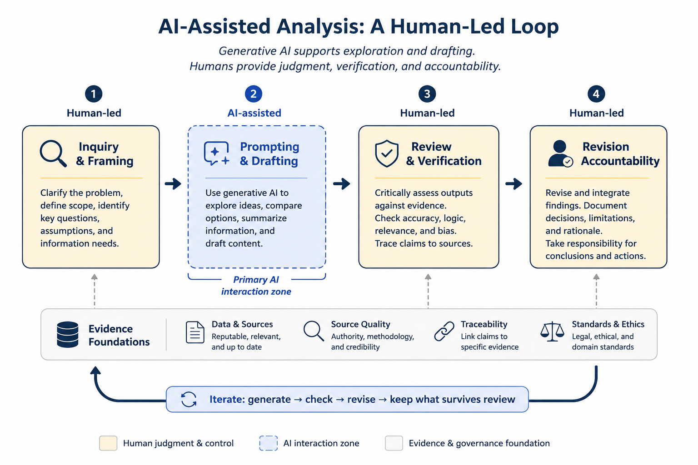

# Conceptual Foundations

Generative AI systems are increasingly positioned as assistants in research, policy analysis, and investigative work. This book adopts that framing deliberately while also establishing clear limits on what such systems can and cannot do. The central concern is not automation for its own sake, but how AI tools can support inquiry, reflection, and analytical writing without displacing human judgment, methodological rigor, or accountability.

The rapid adoption of generative AI has created both opportunities and risks for analytical practice. On one hand, these systems can help analysts explore ideas, organize information, and accelerate drafting processes. On the other hand, the fluency and confidence of AI-generated outputs can create the illusion of reliability even when the underlying reasoning is incomplete, unsupported, or incorrect. This tension is especially important in policy and health analytics, where analytical conclusions may influence public services, funding decisions, governance processes, or health outcomes.

For this reason, the framework presented throughout this book treats generative AI not as an autonomous decision-maker, but as a human-guided analytical assistant operating within clearly defined methodological and ethical boundaries.

The figure below summarizes the human-led lifecycle that frames the use of generative AI throughout this book.

(\#fig:lifecycle-figure)AI-assisted analysis as a human-led lifecycle. Generative AI contributes to exploration and drafting, while verification, judgment, and accountability remain human responsibilities.

As illustrated in the figure, the analytical process begins with human-led inquiry and framing, followed by AI-assisted prompting and drafting. Importantly, the workflow does not end with generation. Human review, evidence verification, revision, and accountability remain central components of the process. The iterative loop shown in the figure emphasizes that AI-assisted analysis is not a linear act of delegation, but a repeated cycle of generation, checking, revision, and refinement.

To describe generative AI as a research assistant is to make a normative claim about how such systems should be used. An assistant may support inquiry, organize information, or help generate alternative perspectives, but it does not determine the direction of analysis, validate conclusions, or assume responsibility for outcomes.

In this book, generative AI systems are treated as instruments that participate in human reasoning processes rather than substitutes for human reasoning itself. This distinction is foundational. While AI systems can generate convincing prose and plausible explanations, they do not possess understanding, epistemic awareness, or independent judgment. Their outputs are generated through probabilistic pattern prediction rather than comprehension.

As a result, AI-generated text should not automatically be interpreted as evidence, expertise, or justification. A coherent response may still contain inaccuracies, unsupported assumptions, fabricated references, or misleading simplifications. Human oversight therefore remains essential at every stage of analytical work. The objective is not to remove humans from the analytical process, but to augment human inquiry while preserving critical thinking and accountability.

One of the most important conceptual distinctions in AI-assisted analysis is the difference between generation and knowledge. Generative AI systems are designed to produce plausible continuations of language based on statistical relationships learned during training. They do not independently verify claims against reality, understand causal relationships in the way humans do, or distinguish truth from plausibility in a reliable epistemic sense.

This distinction matters because analytical environments often reward fluency and confidence. In practice, persuasive language can obscure uncertainty, missing evidence, or flawed reasoning. The risk is not only factual error, but the gradual erosion of methodological discipline if generated outputs are accepted without sufficient scrutiny.

For example, an analyst may use generative AI to propose alternative framings of a policy issue or summarize a collection of reports. While these outputs may be useful starting points, the analyst must still determine whether:

- the information is accurate,
- claims are supported by evidence,
- assumptions are appropriate,
- important context has been omitted, and
- conclusions are logically justified.

Responsibility for interpretation and inference therefore remains human even when AI contributes to the drafting process.

Within these limitations, generative AI can still provide meaningful support for research and investigative work. When used carefully, these systems can enhance exploratory thinking and improve the efficiency of certain analytical tasks. They may assist in structuring complex questions, generating alternative framings, mapping arguments and counterarguments, summarizing large volumes of material, identifying assumptions or ambiguities, and improving clarity and coherence in analytical writing.

These capabilities are best understood as supportive rather than decisive. AI systems may shape the space of possible interpretations, but they do not determine which interpretations are valid, ethical, or evidence-based. As shown in the figure, AI participation is concentrated primarily within the prompting and drafting stages, while inquiry, verification, revision, and accountability remain fundamentally human responsibilities.

A recurring theme throughout this book is that evidence must remain central to analytical practice regardless of how much AI assistance is used. Generative AI can reorganize information and generate useful analytical scaffolding, but it cannot replace source validation, methodological transparency, or evidentiary review. Analytical claims should therefore remain traceable to credible sources, documented assumptions, and reviewable reasoning processes.

Responsible AI-assisted analysis depends on several interconnected practices:

- using reputable and relevant sources,
- evaluating source quality and credibility,
- verifying claims against evidence,
- maintaining traceability between conclusions and supporting information, and
- adhering to legal, ethical, and professional standards.

These practices become especially important in policy and health contexts, where incomplete or misleading outputs may influence real-world decisions.

A guiding principle of this book is that epistemic responsibility cannot be outsourced. While generative AI systems can assist with exploration, drafting, and synthesis, responsibility for accuracy, interpretation, reasoning, evidentiary discipline, and analytical impact remains human.

Analysts remain accountable for what is accepted, rejected, revised, and ultimately communicated. This responsibility extends beyond factual verification. It also includes evaluating whether analytical framing is appropriate, identifying potential bias or omissions, recognizing uncertainty, assessing methodological limitations, and ensuring that ethical and professional standards are maintained throughout the workflow.

In practice, responsible AI-assisted analysis involves continuous review rather than passive acceptance of generated outputs. The iterative workflow presented earlier — generate, check, revise, and retain only what survives review — reflects this philosophy throughout the book.

The chapters that follow build upon this conceptual foundation by introducing practical prompting strategies, review frameworks, governance considerations, and analytical workflows designed to integrate generative AI into professional practice while preserving methodological rigor, transparency, and human accountability.
