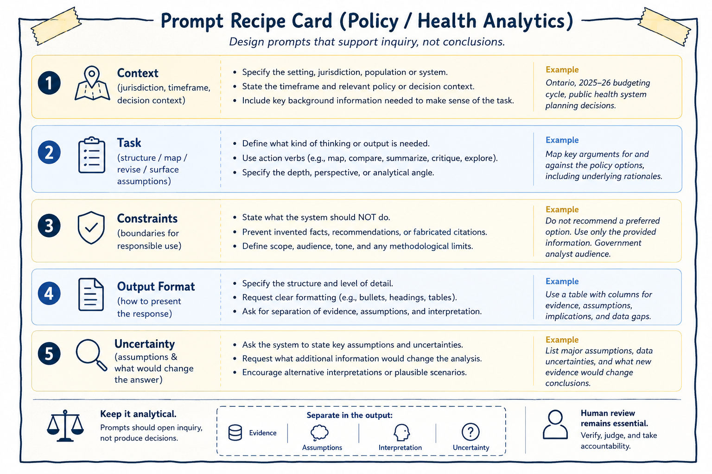

# Prompt Patterns for Inquiry and Synthesis

Prompts are the primary mechanism through which users interact with generative AI systems. In research, policy, and health analytics contexts, prompts are most effective when they are designed to support inquiry, reflection, and structured exploration rather than answer-seeking or automated decision-making. How a prompt is framed shapes not only what the system produces, but also how those outputs are interpreted, trusted, and ultimately used. :contentReference[oaicite:0]{index=0}

This chapter treats prompting as a methodological practice rather than a technical trick. The emphasis is not on “getting the perfect answer,” but on designing interactions that support disciplined analytical thinking while preserving human judgment, accountability, and evidentiary review. In this framework, prompts are tools for thinking with AI rather than instructions for delegating responsibility to AI.

The figure below presents a reusable prompt “recipe card” designed for policy and health analytics workflows.

(\#fig:prompt-recipe-card-figure)Prompt recipe card for inquiry and synthesis. A structured prompt clarifies context, task, constraints, format, and uncertainty while preserving human review and accountability.

As illustrated in the figure, effective prompts typically combine several interconnected elements including contextual framing, a clearly defined analytical task, explicit constraints, expectations regarding output structure, and acknowledgment of uncertainty. Together, these elements help transform prompting from an ad hoc interaction into a more disciplined and transparent analytical practice.

The figure also reinforces two broader principles that recur throughout this book:

> Prompts should support inquiry rather than produce determinate conclusions.

and

> Human review remains essential regardless of how carefully a prompt is designed.

A prompt can therefore be understood as a research instrument. Like surveys, interview protocols, analytical frameworks, or statistical models, prompts shape what becomes visible, what remains implicit, and what kinds of reasoning are encouraged or constrained. Thoughtful prompting requires attention not only to what is being asked, but also to what assumptions are embedded in the request, what kinds of outputs are implicitly rewarded, and what forms of reasoning may unintentionally be excluded.

In this sense, prompts are not neutral.

For example, prompts asking for “the best solution,” “the correct interpretation,” or “the recommended policy” implicitly transfer authority toward the system’s output and encourage premature closure around a single framing.

By contrast, prompts requesting alternative perspectives, competing interpretations, assumptions, counterarguments, limitations, or conditional analyses reinforce the exploratory nature of the interaction. These prompts position generative AI as a tool for generating analytical material to think with rather than as a source of authoritative conclusions.

Designing prompts in this way supports disciplined inquiry while preserving the researcher’s role as the final arbiter of relevance, adequacy, interpretation, and meaning.

The structure of a prompt can also function as a form of analytical governance. Well-designed prompts establish methodological boundaries before generation occurs. They define what the system is being asked to do, what it should avoid doing, how outputs should be organized, and how uncertainty should be treated. This becomes particularly important in policy and health analytics, where generated outputs may influence institutional processes, public communication, or operational decisions.

As shown in the figure, the prompt recipe card encourages analysts to separate evidence, assumptions, interpretation, and uncertainty. This separation matters because AI-generated responses often blend factual claims, inferred assumptions, and interpretive commentary into a single fluent narrative. Without explicit structure, it can become difficult to distinguish what is supported by evidence from what is speculative or inferred.

Prompt structure therefore helps operationalize transparency and accountability within AI-assisted analytical workflows.

The first component of the recipe card is context. Context situates the analytical task within a particular environment, timeframe, jurisdiction, population, or decision setting. Without context, AI systems tend to default toward generalized or decontextualized responses that may not align with the intended analytical purpose.

Useful contextual information may include jurisdictional scope, policy setting, timeframe, stakeholder environment, operational constraints, or broader decision context. For example, a prompt concerning healthcare resource allocation could produce very different outputs depending on whether the setting involves emergency response planning, long-term budgeting, rural service delivery, or Indigenous health governance.

Providing context does not guarantee correctness, but it helps constrain the analytical space within which outputs are generated.

The second component of the recipe card is the analytical task itself. A task defines what kind of analytical activity is being requested. Effective prompts typically rely on action-oriented framing such as asking the system to compare, summarize, map, critique, organize, identify, contrast, or surface assumptions.

These verbs encourage exploratory and analytical behavior rather than authoritative recommendation. For instance, asking a system to “map competing policy perspectives” encourages comparative analysis, whereas asking it to “recommend the best policy option” implicitly encourages unsupported prioritization.

Task specification also helps define the intended depth, scope, perspective, and analytical orientation of the response. The clearer the analytical task, the easier it becomes to review outputs systematically and identify where interpretation, assumptions, or unsupported claims may have entered the workflow.

The third component of the recipe card involves constraints. Constraints are especially important in professional analytical settings because they establish methodological and ethical boundaries before generation occurs.

Examples of constraints may include instructions:
- not to fabricate references,  
- not to recommend preferred options,  
- to identify uncertainties explicitly,  
- to avoid unsupported causal claims,  
- or to maintain a neutral analytical tone.  

These constraints do not eliminate hallucination or analytical error, but they reduce the likelihood that generated outputs drift into unsupported certainty or inappropriate recommendation. In practice, constraints function as safeguards against common failure modes of generative AI systems.

The final components of the recipe card concern output structure and uncertainty. Output formatting is not merely cosmetic. Structured outputs can improve traceability, reviewability, and analytical clarity, particularly when working with large document sets, competing policy arguments, evidence synthesis, or multi-step reasoning tasks.

Prompts may therefore request comparative tables, categorized themes, evidence matrices, or explicit separation between findings and interpretation. As emphasized in the figure, one especially important practice is separating evidence, assumptions, interpretation, and uncertainty. This helps reduce the risk that speculative reasoning will be mistaken for verified information.

Prompting for uncertainty is equally important. One of the most common risks in AI-assisted analysis is that generated outputs may appear more certain than the available evidence justifies. Generative systems are optimized to produce plausible and coherent language rather than calibrated expressions of confidence.

Prompts can partially mitigate this tendency by explicitly requesting assumptions, limitations, information gaps, alternative interpretations, or conditions under which conclusions might change.

For example, prompts may ask:

> “What assumptions underlie this interpretation?”

> “What additional evidence would change the analysis?”

> “What information is currently missing?”

> “What alternative explanations remain plausible?”

These types of prompts encourage reflexive analysis rather than premature closure. Importantly, uncertainty should not be interpreted as analytical weakness. In many policy and health contexts, responsible analysis requires acknowledging ambiguity, incomplete evidence, competing values, and evolving conditions.

Throughout this book, several recurring prompt patterns are used to support inquiry and synthesis. These patterns are not rigid templates, but adaptable approaches that help structure exploratory analytical work.

One common use involves structuring broad or ill-defined problems into smaller analytical questions. For example, a researcher may ask the system to break a broad topic into distinct lines of investigation without prioritizing them. The resulting output may help organize early-stage thinking, but it should not be treated as a definitive representation of the problem space.

Human review remains necessary to identify missing dimensions, revise categories, and ensure alignment with project objectives.

Similarly, generative AI systems can help map competing arguments and counterarguments surrounding a policy issue. Such outputs may help surface trade-offs, tensions, or stakeholder perspectives, but they should not be mistaken for complete or balanced representations of the debate. Unequal evidentiary support, institutional context, or marginalized perspectives may still require independent analysis and domain expertise.

Prompts can also help externalize assumptions, uncertainties, and information gaps embedded within draft analyses. Asking a system to identify implicit assumptions may help reveal dependencies, limitations, or unresolved questions that warrant further investigation. However, AI-generated assumption lists should never be treated as exhaustive. Domain expertise and contextual understanding remain essential for identifying what the system may have overlooked.

Even highly structured prompts remain incomplete representations of analytical intent. No prompt can fully encode contextual understanding, institutional knowledge, ethical judgment, stakeholder dynamics, or domain expertise.

Better prompts reduce ambiguity and improve transparency, but they do not eliminate the need for interpretation and critical review.

Importantly, prompts themselves contain assumptions about what counts as relevant, what evidence is prioritized, what perspectives are foregrounded, and what forms of reasoning are considered acceptable.

Responsible prompting therefore requires reflexivity not only about AI outputs, but also about the framing choices embedded in the prompts themselves.

This chapter has focused on how prompts can support inquiry, synthesis, and structured analytical reflection. The next chapter shifts attention from elicitation to evaluation: how AI-assisted outputs can be reviewed, documented, verified, and governed in ways that preserve methodological rigor and accountability.

Where prompting shapes what is generated, evaluation determines what is accepted, revised, or rejected. Together, these practices form the foundation of responsible AI-assisted analytical work.
