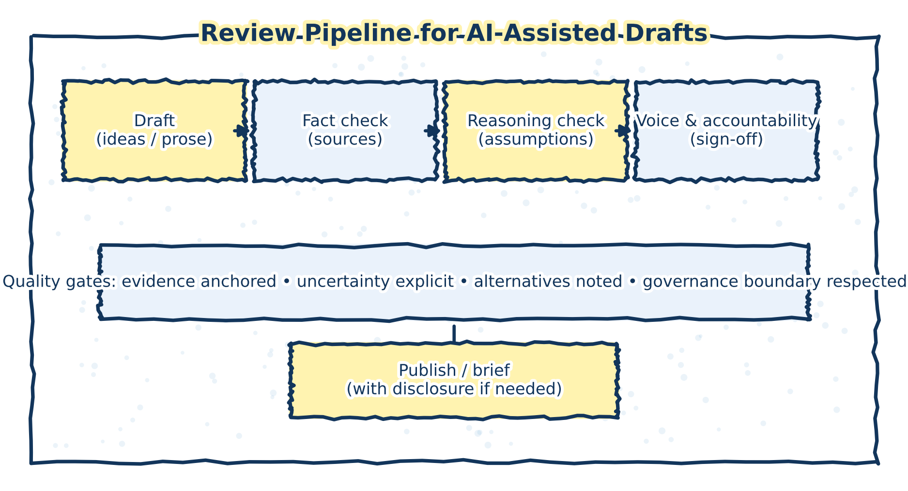
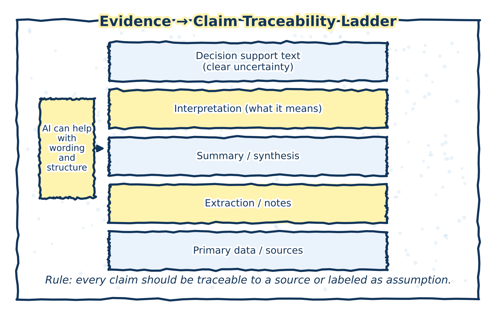

# Reviewing and Revising AI‑Assisted Drafts

Responsible use of generative AI in policy and health analytics requires systematic review and active revision of all AI‑assisted outputs. This chapter outlines practices for maintaining analytical rigor, evidentiary discipline, and authorship when a generative AI assistant is used as part of the thinking or writing process.

The central principle is straightforward: AI‑generated text is always provisional. It becomes part of an analytical product only through deliberate human evaluation, verification, and integration.

The figure below summarizes a review pipeline that turns AI-assisted drafting into an accountable analytical workflow.

(\#fig:review-pipeline-figure)Review pipeline for AI-assisted drafts. The workflow emphasizes fact-checking, reasoning review, uncertainty discipline, and explicit accountability before circulation or briefing.

## Review dimensions (what to check, beyond “is it factually correct?”)

AI-assisted drafts require review across multiple dimensions. The goal is not only to correct factual errors, but to ensure that reasoning, uncertainty, and accountability remain explicit and defensible.

The categories below describe what to review; Appendix A provides the stage-based checklist describing when these checks typically occur.

### 1) Scope and use of AI assistance (governance alignment)

Use is acceptable when AI supports framing, drafting, and reflection without substituting for judgment or validation.

- Ensure AI assistance supported thinking and expression, not decision-making or evaluation.
- Ensure AI output is not treated—explicitly or implicitly—as evidence, validation, or authority.
- Ensure AI use did not substitute for subject-matter expertise, peer review, or institutional oversight.

> **Risks mitigated:** diffusion of responsibility; framing lock-in

### 2) Framing and problem definition

AI can influence framing early and subtly; review should make framing choices intentional rather than inherited.

- Confirm the framing was chosen intentionally rather than adopted from early AI output.
- Confirm alternative framings were considered or consciously ruled out.
- Confirm the framing does not silently privilege one objective (e.g., efficiency) over others (e.g., equity, feasibility).
- Confirm you can articulate what the framing includes and excludes.

> **Risks mitigated:** framing lock-in; invisible assumptions

### 3) Factual accuracy and evidence discipline

AI-generated content can be plausible while wrong. Fluency is not evidence.

- Verify all factual claims introduced or modified with AI assistance against primary or authoritative sources.
- Remove fabricated statistics, examples, references, or pseudo-citations.
- Confirm jurisdiction, population, timeframe, and system context are correct and explicit.
- Ensure summaries are not used as substitutes for engagement with source material.

> **Risks mitigated:** fluency masking uncertainty; false balance

### 4) Reasoning, uncertainty, and analytical integrity

Even when facts are correct, reasoning can be weak, overconfident, or assumption-heavy.

- Confirm conclusions follow logically from premises and evidence.
- Make key assumptions explicit (data, causal, implementation-related).
- Ensure uncertainty, limitations, and evidence gaps are stated clearly and proportionately.
- Ensure claims are not stronger than the supporting evidence allows.
- Distinguish normative judgments from empirical claims.

> **Risks mitigated:** fluency masking uncertainty; invisible assumptions

### 5) Balance, alternatives, and contested issues

AI may present symmetry where evidence is asymmetric.

- Ensure differences in evidence quality are acknowledged when multiple perspectives are presented.
- Avoid presenting competing views as symmetrical unless analytically justified.
- Ensure marginal or weakly supported positions are not inflated through neutral framing.
- Surface trade-offs and value judgments rather than obscuring them.

> **Risks mitigated:** false balance

### 6) Authorship, voice, and accountability

AI assistance should not blur responsibility for claims or conclusions.

- Ensure the document reflects a clear human analytical voice consistent with organizational norms.
- Ensure you can defend every claim, framing choice, and conclusion in your own words.
- Ensure responsibility is clearly attributable to the analyst or team.
- Ensure no claim remains solely because “the AI suggested it.”

> **Risks mitigated:** diffusion of responsibility

### 7) Transparency and disclosure (where appropriate)

Transparency supports interpretability and trust.

- Be able to explain how AI assistance shaped the analytical process if asked.
- Ensure required disclosures are accurate, proportionate, and clear.
- Describe AI as supporting functions, not delegated authority.

> **Risks mitigated:** diffusion of responsibility

## Methodological disclaimer: limits of AI‑assisted drafting

Generative AI systems generate text based on statistical patterns learned during training and the context provided at use time. They do not have access to authoritative data sources unless explicitly provided, do not evaluate evidence quality, and do not understand policy context, legal constraints, or health system realities.

> **Practice note**  
> In policy and health analytics, AI outputs should be treated as draft working material, comparable to an unreviewed internal note—not as validated analysis.

> **Common failure mode**  
> Allowing fluent, confident prose to stand in for evidence‑based reasoning or source verification.

## Verifying factual claims

AI‑generated text may include inaccuracies, outdated information, or fabricated details. Any factual claim introduced through AI assistance—whether explicit or implied—must be checked against primary sources, administrative data, or authoritative literature.

Fluency, specificity, and technical language are not indicators of reliability.

> **Practice note (health/policy context)**  
> High‑risk factual areas include:
> - Quantitative claims (rates, trends, effect sizes)
> - Jurisdictional comparisons
> - Legal or regulatory descriptions
> - Causal claims about interventions or policies

> **Common failure mode**  
> Treating AI‑generated background context as “general knowledge” that does not require citation or verification.

The figure below illustrates how to maintain traceability from primary sources to analytical claims in AI-assisted writing.

(\#fig:traceability-ladder-figure)Evidence-to-claim traceability ladder. AI may assist with wording and structure, but every claim should be traceable to a source or explicitly labeled as an assumption or uncertainty.

### Review and quality‑assurance practices

- Trace each factual claim to a verifiable source  
- Replace unsupported claims with sourced statements or explicit uncertainty  
- Remove invented examples, citations, or statistics entirely  
- Ensure alignment with the correct jurisdiction, timeframe, and population  

## Evaluating reasoning and analytical structure

Beyond factual accuracy, AI‑assisted drafts must be assessed for the quality of reasoning. This includes examining whether conclusions follow from premises, whether alternative interpretations are acknowledged, and whether uncertainty is handled appropriately.

Generative AI systems can reproduce common argumentative structures but do not assess their validity.

> **Practice note**  
> Ask of any AI‑assisted section:  
> *If I removed the prose, would the underlying reasoning still stand on evidence and logic alone?*

> **Common failure mode**  
> Accepting internally consistent reasoning that rests on unexamined assumptions or weak causal logic.

### Key review questions

- Are assumptions stated or merely implied?  
- Are normative judgments clearly separated from empirical claims?  
- Are causal claims proportional to the strength of evidence?  
- Are plausible alternatives or counter‑interpretations acknowledged?  

### Review and quality‑assurance practices

- Re‑outline the argument in bullet form to test logical flow  
- Identify where evidence is doing the work vs. where rhetoric is doing the work  
- Flag conclusions that appear stronger than the supporting analysis  

## Maintaining authorship, accountability, and analytical voice

AI assistance can blur the boundary between drafting and authorship if not handled carefully. In policy and health analytics, maintaining a clear analytical voice is essential for accountability, peer review, and decision‑making.

Authorship requires intentional integration: selecting, revising, rejecting, and reshaping AI‑generated material so that the final product reflects human judgment and responsibility.

> **Practice note**  
> You should be able to explain why every paragraph is written the way it is—regardless of whether AI assisted in drafting it.

> **Common failure mode**  
> Allowing AI‑generated phrasing to dominate tone or framing, resulting in text that feels generic, over‑confident, or misaligned with organizational norms.

### Review and quality‑assurance practices

- Actively rewrite AI‑generated text rather than lightly editing it  
- Ensure the final voice matches organizational standards and audience expectations  
- Confirm that responsibility for conclusions is clearly attributable to the analyst or team  

## Transparency and documentation of AI use

In some policy, research, and health analytics contexts, documenting how AI tools were used is appropriate or required. Transparency supports accountability and helps reviewers interpret the analytical process and its limitations.

At a minimum, analysts should be able to explain:
- Where AI assistance was used (e.g., scoping, drafting, revision)
- What tasks it supported
- How outputs were reviewed and validated

> **Practice note**  
> Transparency does not require detailing every prompt, but it does require clarity about *where human judgment entered the process*.

> **Common failure mode**  
> Treating AI use as either irrelevant (“it was just drafting”) or too sensitive to disclose, thereby undermining trust.

### Documentation practices

- Maintain brief internal notes on AI‑assisted steps  
- Be prepared to describe review and validation processes  
- Use standardized disclosure language where appropriate  

## Iterative use as an analytical discipline

Effective use of generative AI is iterative rather than one‑off. Cycles of prompting, reviewing, revising, and discarding outputs help ensure that the system remains an aid to reasoning rather than a source of unexamined conclusions.

Iteration introduces friction, and that friction is a feature—not a flaw—of responsible analytical practice.

> **Practice note**  
> If AI assistance makes a task feel too easy, that is often a signal to slow down and review more carefully.

> **Common failure mode**  
> Treating the first plausible output as “good enough” and moving on without systematic review.

### Review and quality‑assurance practices

- Build explicit review steps into workflows  
- Expect to discard or substantially revise most AI‑generated text  
- Use peer or supervisor review to test robustness and clarity  

## Closing principle: AI assists; analysts decide

Across all stages of review and revision, the governing principle remains consistent: generative AI assists, but analysts decide. Responsibility for accuracy, reasoning, interpretation, and impact cannot be delegated.

Used with discipline, AI‑assisted drafting can improve clarity and efficiency without compromising rigor. Used without it, the same tools can obscure uncertainty and weaken accountability. The difference lies not in the technology, but in the review practices that surround it.

The review practices described in this chapter are operationalized in Appendix A, which provides a stage‑based pre‑submission checklist for AI‑assisted analytical work.
