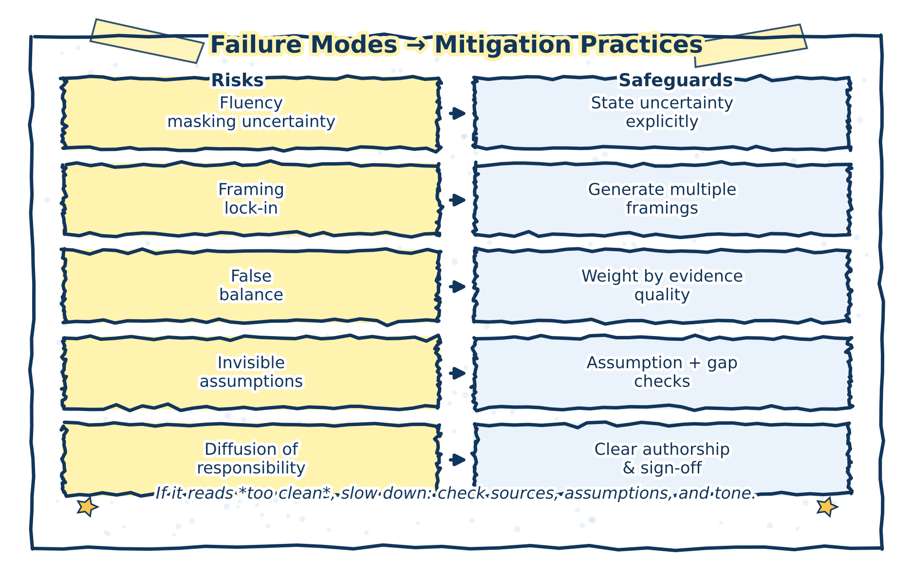

# Failure Modes in AI‑Assisted Policy and Health Analytics

This chapter identifies subtle but consequential failure modes that can arise in AI‑assisted analytical work, even when generative AI tools are used with care and good intentions.

These failure modes are not primarily technical errors. They are epistemic and organizational risks that affect how problems are framed, how evidence is interpreted, and how responsibility is exercised—particularly in policy and health analytics, where analysis often informs decisions with real‑world consequences.

Understanding these failure modes helps analysts recognize when AI assistance is quietly undermining rigor, clarity, or accountability.

## Why failure modes matter

Generative AI systems produce fluent, plausible text that often aligns with common analytical conventions. This makes their outputs easy to adopt and hard to question. As a result, failures tend to be invisible rather than dramatic: uncertainty is smoothed over, assumptions go unexamined, and responsibility becomes diffuse.

> **Practice note**  
> Most AI‑related analytical failures arise not from misuse, but from under‑review.

## Key failure modes

### 1. Fluency masking uncertainty

AI‑generated text often reads as confident and complete, even when underlying evidence is weak, mixed, or missing. Hedging language may be reduced, caveats removed, or uncertainty expressed less explicitly than in the source material.

**Why this matters**  
In policy and health analytics, tone and confidence can materially influence how findings are interpreted by decision‑makers.

> **Illustrative example**  
> An AI‑revised draft replaces “evidence is limited and mixed” with “evidence suggests,” subtly overstating confidence.

**Mitigation**
- Review tone separately from content  
- Reintroduce uncertainty explicitly where appropriate  
- Compare AI‑revised text against original evidence statements  

---

### 2. Framing lock‑in

Early AI‑generated framings—problem definitions, categorizations, or analytical lenses—can silently constrain subsequent analysis. Once adopted, these framings are rarely revisited, even if they exclude relevant perspectives or alternatives.

**Why this matters**  
In policy contexts, framing determines which options appear feasible, relevant, or legitimate.

> **Illustrative example**  
> An early AI‑generated framing emphasizes efficiency, sidelining equity considerations that were not explicitly prompted.

**Mitigation**
- Generate multiple framings deliberately  
- Revisit framing after evidence review  
- Ask explicitly: What does this framing exclude?  

---

### 3. False balance in contested issues

Generative AI often presents opposing views symmetrically, regardless of differences in evidence quality, stakeholder legitimacy, or methodological rigor. This can create an impression of equivalence where none exists.

**Why this matters**  
False balance can distort understanding of consensus, inflate marginal positions, or obscure power and evidence asymmetries.

> **Illustrative example**  
> An AI‑generated summary presents well‑supported public health evidence and anecdotal opposition as parallel “sides” of a debate.

**Mitigation**
- Anchor arguments to evidence strength  
- Distinguish empirical claims from normative positions  
- Avoid presenting symmetry unless it is analytically justified  

---

### 4. Invisible assumptions

AI systems often reproduce common assumptions embedded in training data or prompt context without making them explicit. These assumptions may relate to population homogeneity, data quality, implementation capacity, or causal mechanisms.

**Why this matters**  
Unstated assumptions can drive conclusions while remaining unexamined and unchallenged.

> **Illustrative example**  
> An AI‑assisted analysis assumes stable baseline trends without noting data gaps or recent system changes.

**Mitigation**
- Prompt explicitly for assumptions and dependencies  
- Compare AI‑surfaced assumptions with domain‑expert review  
- Document which assumptions are accepted, tested, or rejected  

---

### 5. Diffusion of responsibility

As AI assistance becomes routine, ownership of analytical choices can blur. Decisions about wording, framing, or inclusion may be attributed implicitly to “the system,” weakening accountability.

**Why this matters**  
Policy and health analytics require clear lines of responsibility for interpretation and conclusions.

> **Illustrative example**  
> A questionable claim is left unchallenged because it “came from the AI” and no one revisits the underlying reasoning.

**Mitigation**
Many of the failure modes described in this chapter arise not from misuse, but from insufficient review; Chapter 5 discusses review and revision as an analytical discipline that mitigates these risks.

- Reinforce authorship and accountability norms  
- Require analysts to defend all claims in their own words  
- Treat AI output as input, not attribution  

## Mitigation as a discipline, not a checklist

Each failure mode requires deliberate analytical discipline, not one‑time safeguards. Effective mitigation relies on:

- Systematic review and revision  
- Explicit evidence anchoring  
- Clear authorship and accountability  
- Peer or supervisory scrutiny  

These practices are most effective when embedded in routine workflows, rather than applied selectively or after the fact.

The figure below synthesizes the relationship between recurring failure modes and the review practices that mitigate them.

(\#fig:failure-modes-map-figure)Common failure modes in AI‑assisted policy and health analytics and corresponding mitigation practices. Most risks arise from under‑review rather than misuse.

## Closing reflection

Failure modes in AI‑assisted analysis are rarely obvious. They accumulate quietly through small shifts in tone, framing, and responsibility. Recognizing these patterns is a precondition for responsible use.

Used with awareness and discipline, generative AI can support analytical work without compromising rigor. Used without it, the same tools can subtly erode the very standards they are meant to assist.

This book does not resolve questions of legal liability, procurement policy, or model evaluation. Its focus is on analytical practice and responsibility, not institutional compliance.
