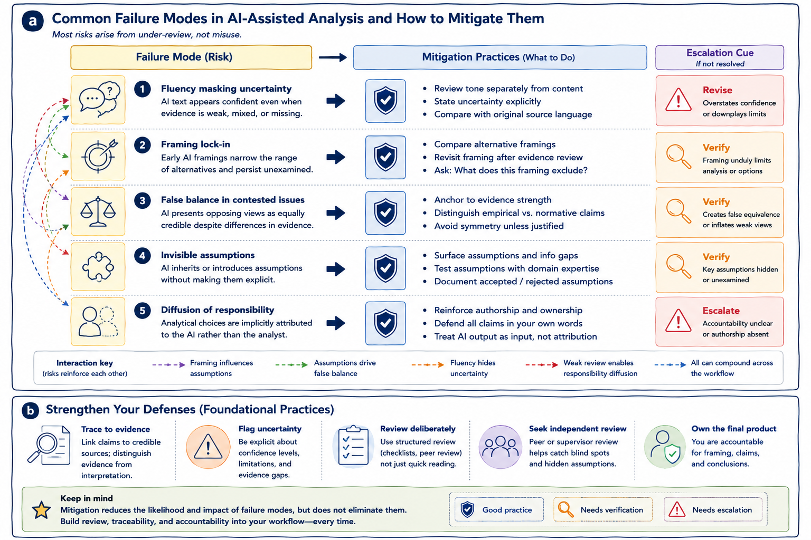

# Failure Modes in AI-Assisted Policy and Health Analytics

This chapter examines subtle but consequential failure modes that can emerge in AI-assisted analytical work, even when generative AI tools are used carefully and with good intentions. The risks discussed here are not primarily technical malfunctions. Rather, they are epistemic and organizational risks that affect how problems are framed, how evidence is interpreted, how uncertainty is communicated, and how accountability is maintained. :contentReference[oaicite:0]{index=0}

These risks are especially important in policy and health analytics, where analytical outputs may influence operational decisions, resource allocation, governance processes, public communication, and health outcomes. Understanding these failure modes helps analysts recognize when AI assistance is quietly undermining rigor, transparency, interpretive balance, or accountability even when outputs appear coherent and professionally written.

The figure below summarizes recurring failure modes in AI-assisted analysis and corresponding mitigation practices. Panel (a) maps common analytical risks to review and mitigation strategies, while panel (b) highlights foundational practices that strengthen analytical resilience across workflows.

(\#fig:failure-modes-map-figure)Panel (a) maps common failure modes in AI-assisted policy and health analytics to corresponding mitigation practices and escalation cues. Panel (b) highlights foundational practices that strengthen analytical resilience through evidence traceability, uncertainty visibility, review discipline, and accountable authorship.

As illustrated in panel (a), most analytical risks arise not from deliberate misuse, but from under-review, over-trust, weak governance, or gradual erosion of analytical discipline. Panel (b) complements this perspective by emphasizing foundational practices such as evidence traceability, explicit uncertainty, independent review, and ownership of conclusions, all of which help reduce the likelihood and impact of these risks across analytical workflows.

Together, the two panels reinforce a central principle of this book:

> The greatest risks in AI-assisted analysis are often subtle shifts in framing, confidence, interpretation, and accountability rather than obvious technical failure.

Generative AI systems produce fluent and plausible text that frequently aligns with familiar analytical conventions. This fluency makes outputs easy to adopt, easy to circulate, and difficult to question critically. As a result, analytical failures are often gradual and difficult to detect. Instead of obvious errors, the effects may appear as softened uncertainty, narrowed framing, hidden assumptions, inflated confidence, weakened review, or blurred ownership of conclusions.

Importantly, these shifts can accumulate over time across drafting, revision, synthesis, and review workflows. Most AI-assisted analytical failures therefore arise not from intentional misuse, but from insufficient review and uncritical adoption of plausible outputs.

Panel (a) visualizes this directly by mapping recurring risks to mitigation practices and escalation cues. The figure also illustrates an important reality: failure modes rarely occur in isolation. In practice, subtle framing effects, hidden assumptions, confident wording, and weak review practices often reinforce one another.

For example, an early AI-generated framing may narrow the analytical lens. Subsequent AI-assisted drafting may then reinforce that framing fluently, while hidden assumptions remain unexamined and weak review allows unsupported interpretations to persist. Over time, these compounded effects may materially shape conclusions even when no single step appears obviously incorrect.

This cumulative nature is one reason why review discipline, evidence traceability, and accountable authorship remain central safeguards throughout AI-assisted analytical workflows.

One of the most common risks in AI-assisted analysis is that fluent prose can obscure uncertainty. AI-generated text often reads as confident, complete, and internally coherent even when evidence is weak, assumptions remain unresolved, or information is incomplete.

As illustrated in panel (a), fluency masking uncertainty is mitigated by reviewing tone, confidence, and evidentiary support separately rather than assuming polished prose reflects analytical strength. In policy and health analytics, tone and confidence can significantly influence interpretation, prioritization, stakeholder response, and decision-making.

A statement that appears overly certain may unintentionally overstate evidence, suppress ambiguity, or create false impressions of consensus. For example, an AI-assisted revision may transform:

> “evidence is limited and mixed”

into:

> “evidence suggests,”

subtly increasing perceived confidence while reducing visibility of uncertainty.

Mitigation therefore requires deliberate review of wording, confidence, and evidence alignment. Analysts may need to compare revised wording against original evidence statements, reintroduce uncertainty explicitly, and distinguish confidence in evidence from fluency of expression.

Panel (b) reinforces this principle through its emphasis on uncertainty visibility and disciplined review practices.

Another important failure mode involves framing lock-in. Early AI-generated framings can silently constrain subsequent analysis. Once a framing is introduced through categorization, prioritization, thematic organization, or problem definition, it may become embedded within the workflow and remain largely unchallenged.

As shown in panel (a), framing lock-in frequently interacts with hidden assumptions, false balance, and selective interpretation, reinforcing analytical narrowing across later stages of drafting and synthesis.

Framing matters because it shapes what questions appear important, what options seem feasible, what evidence receives attention, and what perspectives remain visible. For example, an AI-generated framing emphasizing operational efficiency may unintentionally sideline equity considerations, stakeholder impacts, implementation feasibility, or long-term consequences.

Responsible mitigation therefore requires deliberate comparison of alternative framings, revisiting framing after evidence review, and asking explicitly what a framing excludes. Importantly, generating multiple framings is not sufficient on its own. Those framings must also be reviewed critically and compared explicitly.

Generative AI systems may also create false balance in contested issues. Because these systems frequently present opposing views symmetrically, they can create misleading appearances of equivalence even when evidence quality differs substantially, methodological rigor is uneven, or one position is weakly supported.

As illustrated in panel (a), false balance is mitigated by explicitly differentiating evidence strength rather than treating all perspectives as analytically equal. False balance may distort perceptions of consensus, inflate marginal positions, obscure evidentiary asymmetry, or normalize unsupported claims.

Analytical neutrality does not require treating all positions as equally credible.

For example, an AI-generated summary may present well-supported public health findings and anecdotal opposition as parallel “sides” of a debate despite major differences in evidentiary support.

Mitigation therefore requires anchoring claims to evidence quality, distinguishing empirical findings from normative positions, avoiding symmetry unless analytically justified, and explicitly differentiating levels of evidentiary support.

Panel (b) reinforces this principle through its emphasis on evidence traceability and separation between evidence and interpretation.

Invisible assumptions represent another important failure mode. Generative AI systems often reproduce assumptions embedded within prompts, training data, institutional norms, or dominant analytical conventions without making those assumptions explicit.

These assumptions may concern data completeness, implementation feasibility, stakeholder behavior, causal relationships, baseline conditions, or population homogeneity. As shown in panel (a), invisible assumptions frequently reinforce framing lock-in and may quietly shape analytical conclusions if not surfaced deliberately.

For example, an AI-assisted analysis may assume stable baseline trends despite recent operational disruptions, incomplete data coverage, or changing contextual conditions.

Mitigation therefore involves surfacing assumptions explicitly, identifying information gaps, testing assumptions against evidence, comparing AI-surfaced assumptions with domain expertise, and documenting accepted, rejected, or unresolved assumptions.

Panel (b) reinforces this through the foundational practices of deliberate review, independent scrutiny, and accountable interpretation.

Another important organizational risk involves diffusion of responsibility. As AI assistance becomes normalized, ownership of analytical choices may gradually become blurred. Decisions regarding wording, framing, emphasis, or inclusion may increasingly become attributed implicitly to “the system” rather than to accountable human analysts.

This matters because policy and health analytics require clear responsibility for interpretation, evidence use, conclusions, and analytical consequences. When responsibility becomes diffuse, unsupported claims may persist because no individual feels fully accountable for challenging or revising them.

For example, a problematic analytical statement may remain in a draft simply because:

> “the AI generated it,”

and no reviewer revisits the underlying reasoning.

Mitigation therefore requires reinforcing authorship and analytical ownership, requiring analysts to defend claims in their own words, treating AI output as input rather than attribution, and maintaining explicit human sign-off and review responsibility.

Panel (b) reinforces this principle directly:

> Own the final product.

Another important organizational risk involves automation complacency and review fatigue. Because AI-generated outputs are often polished, coherent, and “good enough,” analysts may gradually begin reviewing outputs less critically over time.

This may lead to superficial verification, reduced skepticism, weaker scrutiny, and growing dependence on generated material. This form of automation complacency is especially risky because it often develops gradually and without explicit awareness.

Analytical rigor depends on deliberate friction: questioning assumptions, checking evidence, comparing alternatives, and revisiting interpretations. When review becomes rushed or routine, subtle analytical weaknesses may accumulate unnoticed.

Panel (b) highlights several foundational safeguards against this risk, including deliberate structured review, explicit uncertainty review, independent peer or supervisory review, evidence traceability, and clear accountability for conclusions.

Importantly, mitigation practices should not be understood as one-time fixes or procedural checklists. As illustrated across both panels, effective mitigation depends on continuous review, evidence discipline, explicit uncertainty, independent scrutiny, and accountable authorship.

Mitigation practices reduce the likelihood and impact of failure modes, but they do not eliminate them entirely. This is why review loops, governance structures, evidence traceability, and analytical accountability must remain embedded within routine workflows rather than applied selectively after drafting is complete.

Panel (b) summarizes several foundational practices that strengthen resilience across all stages of AI-assisted analytical work. Analytical claims should remain traceable to identifiable sources, credible evidence, and reviewable reasoning. Uncertainty should remain visible rather than being smoothed away through polished prose. Review should involve structured scrutiny rather than quick proofreading. Independent review should help identify blind spots, framing effects, hidden assumptions, and unsupported interpretations.

Ultimately, analysts remain accountable for framing, interpretation, evidence use, and conclusions regardless of how much AI assistance was involved in the workflow.

Failure modes in AI-assisted analysis are therefore rarely dramatic. More often, they emerge gradually through subtle shifts in framing, confidence, interpretation, review intensity, and accountability. Recognizing these patterns is a prerequisite for responsible analytical practice.

Used with awareness and disciplined review, generative AI can support exploratory thinking, drafting, synthesis, and communication without compromising rigor. Used without systematic review and governance, the same tools can quietly erode evidentiary discipline, uncertainty visibility, analytical balance, and accountability.

The difference lies not in the technology itself, but in the review, traceability, and governance practices that surround its use.

Readers interested in broader governance and epistemic discussions may consult the resources listed in Appendix C, including literature related to responsible AI frameworks, epistemic uncertainty, analytical governance, and human–AI interaction in knowledge work.
