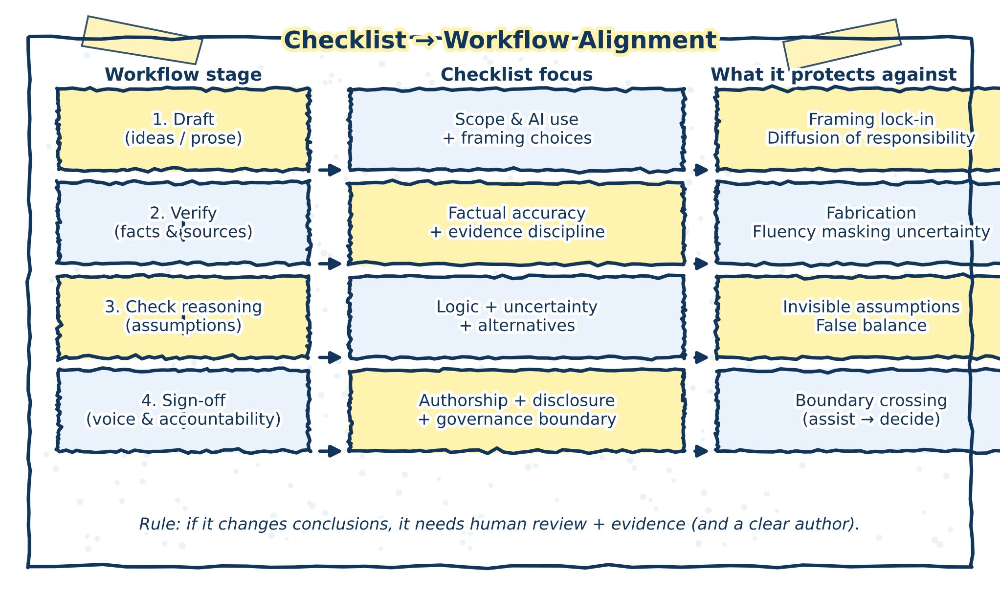

# Appendix A: Pre‑Submission Review Checklist for AI‑Assisted Analysis {-}

This checklist supports responsible use of generative AI assistants in policy and health analytics. It is intended for use before circulation, briefing, or publication of any analytical product that involved AI assistance at any stage.

The checklist operationalizes the governance principles and failure modes described in Chapters 5 and 6. 

---

## 1. Scope and use of AI assistance (governance alignment)

- [ ] I can clearly describe where AI assistance was used (e.g., scoping, drafting, revision).
- [ ] AI assistance supported thinking, structuring, or expression, not decision‑making or evaluation.
- [ ] No AI output is presented—explicitly or implicitly—as evidence, validation, or authority.
- [ ] AI use did not substitute for subject‑matter expertise, peer review, or institutional oversight.

> **Failure modes addressed:** diffusion of responsibility, framing lock‑in

---

## 2. Framing and problem definition

- [ ] The analytical framing was chosen intentionally, not adopted uncritically from early AI output.
- [ ] Reasonable alternative framings were considered or consciously ruled out.
- [ ] The framing does not silently privilege a single objective (e.g., efficiency) at the expense of others (e.g., equity, feasibility).
- [ ] I can articulate what this framing includes and excludes.

> **Failure modes addressed:** framing lock‑in, invisible assumptions

---

## 3. Factual accuracy and evidence discipline

- [ ] All factual claims introduced or modified with AI assistance are verified against primary or authoritative sources.
- [ ] No fabricated statistics, examples, references, or pseudo‑citations remain.
- [ ] Jurisdiction, population, timeframe, and system context are correct and explicit.
- [ ] AI‑generated summaries are not treated as substitutes for engagement with source material.

> **Failure modes addressed:** fluency masking uncertainty, false balance

---

## 4. Reasoning, uncertainty, and analytical integrity

- [ ] Conclusions follow logically from stated premises and evidence.
- [ ] Key assumptions (data, causal, implementation‑related) are made explicit.
- [ ] Uncertainty, limitations, and evidence gaps are clearly stated and proportionate.
- [ ] Claims are not stronger or more confident than the underlying evidence supports.
- [ ] Normative judgments are distinguishable from empirical claims.

> **Failure modes addressed:** fluency masking uncertainty, invisible assumptions

---

## 5. Balance, alternatives, and contested issues

- [ ] Where multiple perspectives are presented, differences in evidence quality are acknowledged.
- [ ] Competing views are not presented as symmetrical unless analytically justified.
- [ ] Marginal or weakly supported positions are not inflated through neutral framing.
- [ ] Trade‑offs and value judgments are surfaced rather than obscured.

> **Failure modes addressed:** false balance

---

## 6. Authorship, voice, and accountability

- [ ] The document reflects a clear human analytical voice consistent with organizational norms.
- [ ] I can explain and defend every claim, framing choice, and conclusion in my own words.
- [ ] Responsibility for analysis and conclusions is clearly attributable to the analyst or team.
- [ ] No claim remains solely because “the AI suggested it.”

> **Failure modes addressed:** diffusion of responsibility

---

## 7. Transparency and disclosure (where appropriate)

- [ ] I can explain how AI assistance shaped the analytical process if asked.
- [ ] Any required disclosures about AI use are accurate, proportionate, and clear.
- [ ] AI use is described in terms of supporting functions, not delegated authority.

---

The figure below shows how the pre‑submission checklist aligns with the review workflow and governance principles described earlier in the book.

(\#fig:checklist-workflow-alignment-figure)Alignment between the pre-submission review checklist, the AI-assisted review pipeline, and governance boundaries.

Read this figure from top to bottom: the checklist is not an add-on, but a condensed representation of the same review and accountability practices applied throughout the analytical workflow.

## Final integrity check

- [ ] If AI assistance were removed entirely, the analysis would still stand on evidence, reasoning, and professional judgment.
- [ ] The use of AI has not reduced clarity about uncertainty, responsibility, or analytical limits.
- [ ] I am comfortable defending this work in a review, audit, or public‑facing context.

> **Governing principle**  
> Generative AI assists; analysts decide.
