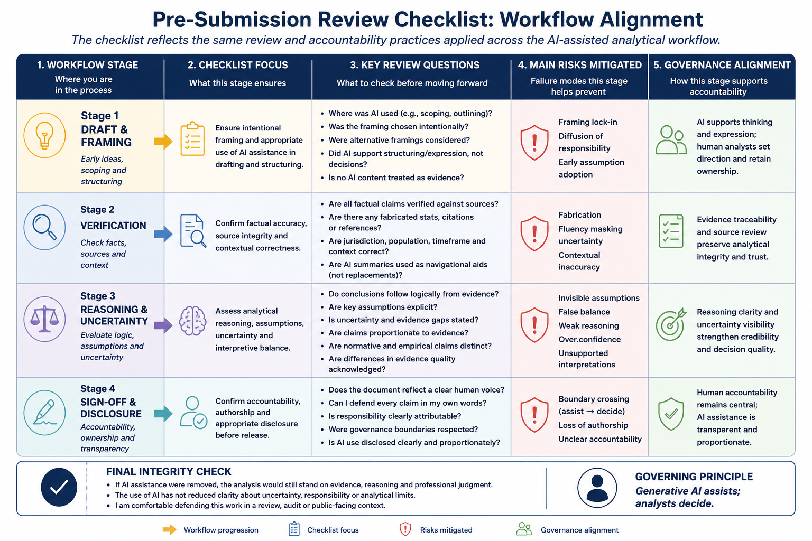

# Appendix A: Pre-Submission Checklist 

This appendix provides a practical review checklist for AI-assisted analytical work in policy and health contexts. The checklist is intended for use before:  
- circulation,  
- briefing,  
- publication,  
- operational use,  
- or decision support  

whenever generative AI assistance has contributed to the workflow at any stage.

The checklist operationalizes many of the governance principles, review practices, and failure-mode safeguards discussed throughout the book. Rather than functioning as a standalone compliance exercise, it condenses the broader analytical discipline described in earlier chapters into a structured pre-submission review process.

The figure below illustrates how the checklist aligns with the broader AI-assisted analytical workflow presented earlier in the book.

(\#fig:checklist-workflow-alignment-figure)Alignment between workflow stages, checklist review focus, and the failure modes each review stage is intended to mitigate. The checklist operationalizes review discipline, evidence traceability, and governance boundaries across the lifecycle of AI-assisted analytical work.

As illustrated in the figure, the checklist mirrors the broader lifecycle of AI-assisted analytical work:  
- drafting,  
- verification,  
- reasoning review,  
- and final sign-off.  

Each review stage also corresponds to specific analytical risks discussed earlier in the book. In this sense, the checklist is not an additional governance layer applied after analysis is complete. It is a condensed representation of the same:  
- review practices,  
- evidence safeguards,  
- accountability structures,  
- and governance boundaries  

that should remain active throughout the analytical workflow itself.

The checklist is intentionally structured around progressive review rather than simple error detection. Earlier stages focus primarily on:  
- framing,  
- scope,  
- and appropriate use of AI assistance,  

while later stages focus increasingly on:  
- evidence traceability,  
- analytical reasoning,  
- uncertainty,  
- accountability,  
- and governance boundaries.  

This progression reflects an important principle emphasized throughout the book:  

> As analytical influence increases, expectations for review and accountability also increase.

The checklist is therefore not intended to eliminate all risk or guarantee correctness. Instead, it functions as a structured mechanism for slowing down review, surfacing assumptions, clarifying accountability, and preserving evidentiary discipline before analytical products are circulated or relied upon.

## Stage 1: Draft and framing

The first stage focuses on how the analytical task was framed and how AI assistance entered the workflow. This stage is particularly important because many downstream analytical problems originate from:  
- weak framing,  
- hidden assumptions,  
- premature narrowing of scope,  
- or inappropriate delegation of judgment.  

As shown in the figure, this stage primarily protects against:  
- framing lock-in,  
- and diffusion of responsibility.  

At this stage, the analyst should be able to explain:  
- where AI assistance was used,  
- why it was used,  
- and what role it played in shaping the analytical workflow.  

AI assistance should support:  
- structuring,  
- exploration,  
- drafting,  
- or organizational clarity  

without replacing:  
- interpretation,  
- evidence review,  
- or decision-making authority.  

The following questions support review at this stage:  

- [ ] I can clearly describe where AI assistance was used at this stage (e.g., scoping, outlining, drafting).
- [ ] The problem framing was chosen intentionally and not adopted uncritically from AI output.
- [ ] Reasonable alternative framings were considered or explicitly ruled out.
- [ ] AI assistance supported structuring or expression rather than evaluation or decision-making.
- [ ] No AI-generated content is treated as evidence or justification.

Importantly, this stage should also include reflection on what the framing may exclude. Analysts should ask:
> What assumptions, perspectives, or contextual dimensions may have been unintentionally narrowed or omitted?

This deliberate friction helps prevent early AI-generated framing from quietly shaping the remainder of the workflow without review.

## Stage 2: Verification

The second stage focuses on factual accuracy and evidentiary discipline. As illustrated in the figure, this review stage primarily protects against:  
- fabrication,  
- and fluency masking uncertainty.  

Generative AI systems can produce plausible but incorrect:  
- statistics,  
- contextual statements,  
- citations,  
- examples,  
- or summaries.  

Because generated prose is often coherent and professionally written, unsupported claims can easily survive into later drafting stages if verification is rushed or incomplete.

Verification therefore requires more than checking isolated facts. It also involves confirming:  
- contextual accuracy,  
- source integrity,  
- proportionality of claims,  
- and appropriate representation of evidence.  

The following checklist items support review at this stage:  

- [ ] All factual claims are verified against primary or authoritative sources.
- [ ] No fabricated statistics, examples, citations, or references remain.
- [ ] Jurisdiction, population, timeframe, and system context are correct and explicit.
- [ ] AI-generated summaries are used only as navigational aids rather than substitutes for source review.

This stage also reinforces a broader methodological principle discussed throughout the book:

> AI-generated summaries are not evidence.

Generated synthesis may assist orientation and navigation across large document sets, but analytical legitimacy still depends on engagement with identifiable and reviewable source material.

Verification should therefore preserve:  
- evidence traceability,  
- source accountability,  
- and visibility of uncertainty.  

## Stage 3: Reasoning and uncertainty

The third stage focuses on analytical reasoning, assumptions, interpretation, and uncertainty management. As shown in the figure, this stage primarily protects against:  
- invisible assumptions,  
- false balance,  
- and weak analytical reasoning.  

Importantly, analytical problems often persist even when factual statements are technically correct. A document may still contain:  
- unsupported inference,  
- hidden assumptions,  
- disproportionate confidence,  
- misleading framing,  
- or weak causal reasoning.  

This stage therefore asks whether conclusions genuinely follow from:  
- evidence,  
- assumptions,  
- and stated premises.  

Review at this stage should also examine whether uncertainty remains visible and proportionate. One of the most common risks in AI-assisted analytical writing is that generated prose may sound more confident than the underlying evidence justifies.

The following questions support review at this stage:   

- [ ] Conclusions follow logically from stated premises and evidence.
- [ ] Key assumptions (data, causal, or implementation-related) are made explicit.
- [ ] Uncertainty, limitations, and evidence gaps are clearly stated and proportionate.
- [ ] Claims are not stronger or more confident than the underlying evidence supports.
- [ ] Normative judgments are distinguishable from empirical claims.
- [ ] Where multiple perspectives are presented, differences in evidence quality are acknowledged.

This stage should also include deliberate reflection on:  
- what remains uncertain,  
- what assumptions remain unresolved,  
- and what additional evidence could change the interpretation.  

As emphasized throughout the book, responsible analytical work does not eliminate uncertainty. It makes uncertainty visible, reviewable, and appropriately proportional to the available evidence.

## Stage 4: Sign-off and disclosure

The final stage focuses on:  
- accountability,  
- authorship,  
- governance boundaries,  
- and readiness for circulation or publication.  

As illustrated in the figure, this stage primarily protects against:  
- boundary crossing,  
- inappropriate delegation of authority,  
- and loss of analytical accountability.  

At this stage, the central question is no longer:
> “Was AI used?”

but rather:
> “Does responsibility for the final analytical product remain clearly human?”

Analysts should remain able to:
- explain conclusions,
- defend reasoning,
- justify framing choices,
- and account for uncertainty independently of the AI system.

The following checklist items support final review:

- [ ] The document reflects a clear human analytical voice consistent with organizational norms.
- [ ] I can explain and defend every claim, framing choice, and conclusion in my own words.
- [ ] Responsibility for the analysis and conclusions is clearly attributable.
- [ ] AI assistance did not cross governance boundaries (e.g., into validation or decision-making).
- [ ] Where appropriate, AI use is disclosed clearly and proportionately.

This stage also reinforces an important governance principle discussed earlier in the book:

> AI assistance may support drafting and synthesis, but authority cannot be delegated.

Disclosure practices should remain proportional to:  
- the analytical role AI played,  
- the sensitivity of the work,  
- and institutional expectations regarding transparency and review.  

## Final integrity reflection

The final review questions function as an overall integrity check before circulation, publication, or operational use.

Rather than focusing on isolated technical issues, these questions ask whether the analysis still stands as a defensible human product after AI assistance is considered.

- [ ] If AI assistance were removed entirely, the analysis would still stand on evidence, reasoning, and professional judgment.
- [ ] The use of AI has not reduced clarity about uncertainty, responsibility, or analytical limits.
- [ ] I am comfortable defending this work in a review, audit, or public-facing context.

These questions are intentionally reflective rather than procedural. They encourage analysts to step back from:  
- drafting,  
- prompting,  
- and editing  

and instead assess the overall integrity of the analytical product.

Throughout this appendix, one governing principle remains consistent:

> Generative AI assists; analysts decide.

The checklist presented here is therefore not merely administrative. It operationalizes the broader themes developed throughout the book:  
- evidence traceability,  
- explicit uncertainty,  
- accountable authorship,  
- disciplined review,  
- and governance-aware analytical practice.  

Used consistently, the checklist helps preserve:  
- methodological rigor,  
- transparency,  
- accountability,  
- and analytical integrity  

within AI-assisted policy and health analytics workflows.
